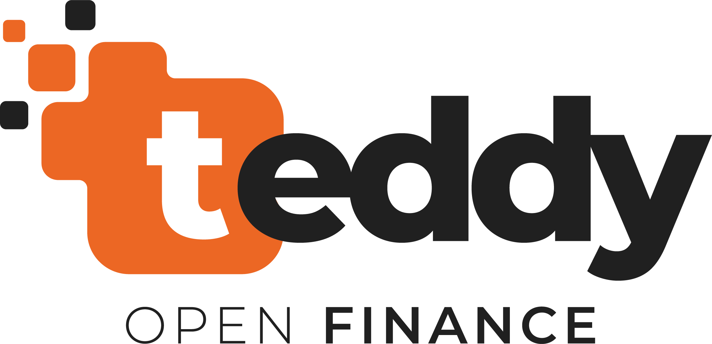

# 🐳 Projeto Teddy Finance - Dockerizado com Docker Compose

Este projeto é composto por **duas aplicações**: **Frontend (React)** e **Backend (NestJS)**. 
Ambas são gerenciadas por **Docker Compose** para simplificar a configuração e a execução.
O banco de dados usado é o **Postgres SQL** e também está sendo gerido pelo Docker Compose.

---

## ⚙️ Requisitos

- **Docker** e **Docker Compose** instalados
- **Git** (opcional, para clonar o repositório)

---

## 🛠️ Estrutura do Projeto

- **`/frontend`** - Aplicação React (Frontend)
- **`/backend`** - Aplicação NestJS (Backend)

---

## 📦 Configuração Inicial

### **Clonar o repositório**
```bash
git clone https://github.com/rafa-coelho/teddy.git
cd teddy
```

## 🚀 Executando o Projeto com Docker Compose

Execute o comando abaixo na raiz do projeto:
```bash
docker-compose up --build -d
```

## 🖥️ Acessar as aplicações
- Frontend: http://localhost:5173
- Backend: http://localhost:3000
- Swagger API Docs: http://localhost:3000/swagger
